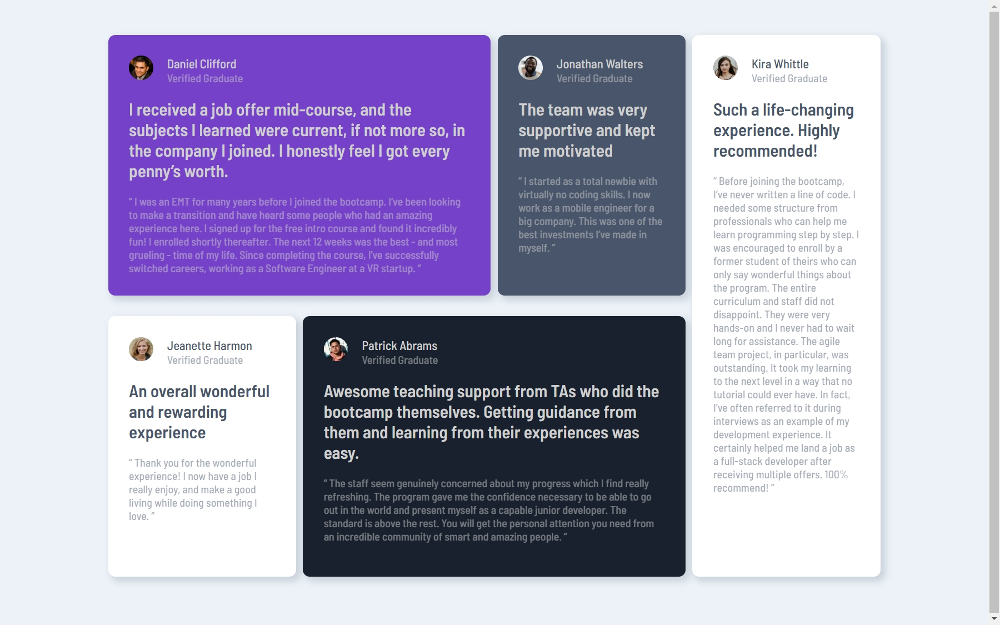

# Testimonials grid section solution

## Table of contents

- [Overview](#overview)
  - [The challenge](#the-challenge)
  - [Screenshot](#screenshot)
  - [Links](#links)
- [My process](#my-process)
  - [Built with](#built-with)
- [Author](#author)

**Note: Delete this note and update the table of contents based on what sections you keep.**

## Overview

### The challenge

Users should be able to:

- View the optimal layout for the site depending on their device's screen size

### Screenshot

### Links

- Solution URL: [solution URL](https://github.com/rakesh265/testimonials-grid-section)
- Live Site URL: [live site URL](https://testimonials-grid-section-alpha-eight.vercel.app/)

## My process

### Built with

- Semantic HTML5 markup
- CSS custom properties
- Flexbox
- CSS Grid

## Author

- by - RAKESH MUNJALA
- Linkedin - [@Rakesh Munjala](https://www.linkedin.com/in/rakesh-munjala-024711238/)
- Frontend Mentor - [@rakesh265](https://www.frontendmentor.io/profile/rakesh265)

